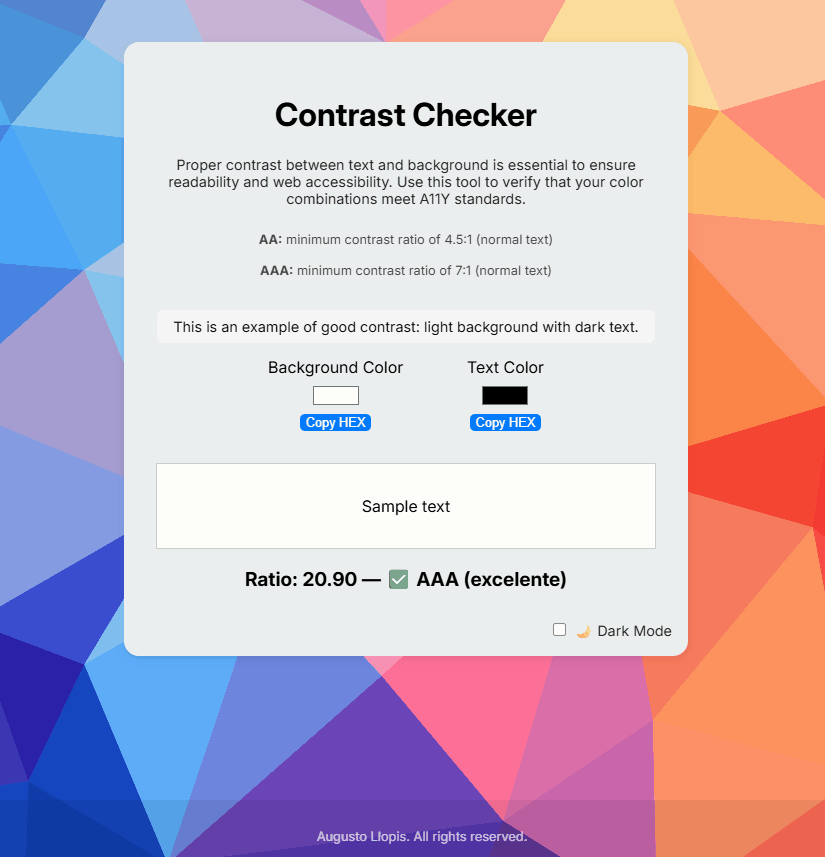

# A11Y Contrast Checker 🌗

  

A simple, responsive web tool to test color contrast ratios between background and text colors — following WCAG accessibility standards.

## 🧩 Features

- 🎨 Live preview of your color combination
- 📋 Copy HEX values with one click
- 🌗 Dark mode toggle with saved preference
- 🔢 Contrast ratio calculation based on WCAG 2.1
- ✅ Result badges for AA / AAA compliance
- 💡 Educational info about contrast levels

---

## 🚀 How to Use

1. Select a background and text color using the pickers.
2. See the contrast ratio update live.
3. Check if it meets **AA** or **AAA** accessibility requirements.
4. Click "Copy HEX" to copy the color values.

---

## 📚 Tech Stack

- HTML5 + CSS3
- Vanilla JavaScript
- LocalStorage
- WCAG Contrast Algorithm

---

## 🧠 Lessons Learned

Built as a personal accessibility experiment. I learned:
- How to calculate luminance and contrast ratio manually
- How to persist UI state (dark mode) with localStorage
- How to structure and style a small responsive tool
- Importance of accessibility in design

---

## 🧑‍💻 Author

Made by [Augusto Llopis](https://portfolio-augusto.netlify.app/)  
Feel free to use, share, or improve it.

---

## 🌐 Demo

👉 [Live site on Netlify](https://contrast-checker11.netlify.app/) 
👉 [Source code on GitHub](https://github.com/llopisar/contrast-checker)
